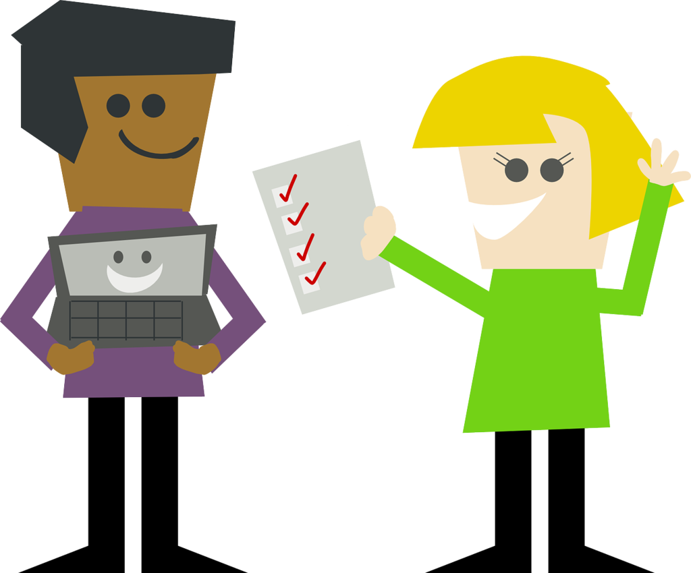
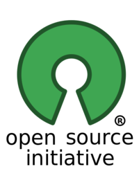

author: Rafael García Cabrera
title: Free Software
subtitle: IES Virgen del Carmen (Jaén)
cover: images/binary.png
lang: en
theme: material

<!-- 
binary.png from
https://pixabay.com/en/binary-one-null-monitor-social-503590/
CC0 Creative Commons
https://pixabay.com/en/service/terms/#usage
-->

## What is free software?

## [What is free software?](https://www.gnu.org/philosophy/free-sw.en.html)

> "Free software" means software that respects users' freedom and community. Roughly, it means that **the users have the freedom to run, copy, distribute, study, change and improve the software**. Thus, "free software" is a matter of liberty, not price. To understand the concept, you should think of "free" as in "free speech," not as in "free beer". We sometimes call it "libre software," borrowing the French or Spanish word for "free" as in freedom, to show we do not mean the software is gratis.

## The four essential freedoms
<!-- 
https://pixabay.com/en/freedom-jump-reach-silhouettes-307791/
CC0 Creative Commons
https://pixabay.com/en/service/terms/#usage
-->

## freedoms

A program is free software if the program's users have the four essential freedoms:
- **freedom 0**: to **run the program** as you wish, for any purpose.
- **freedom 1**: to study how the program works, and **change it** so it does your computing as you wish.
- **freedom 2**: to **redistribute copies** so you can help others.
- **freedom 3**: to **distribute copies of your modified versions** to others.

> Freedoms 1 and 3 require **Access to the source code**. 

## Free Software
<!-- 
https://pixabay.com/en/checklist-collaboration-characters-150938/
CC0 Creative Commons
https://pixabay.com/en/service/terms/#usage
-->

## Free Software

A program is **free software** if it gives users adequately all of these freedoms. Otherwise, it is **nonfree**.

The reason they are numbered 0, 1, 2 and 3 is historical. Around 1990 there were three freedoms, numbered 1, 2 and 3. Then we realized that the freedom to run the program needed to be mentioned explicitly. It was clearly more basic than the other three, so it properly should precede them. Rather than renumber the others, we made it freedom 0.

## Freedom 0: run it

**The freedom to run the program as you wish**. In this freedom, it is the *user's* purpose that matters, not the *developer's* purpose.

The freedom to run the program as you wish means that you are not forbidden or stopped from making it run.

## Freedom 1: change it

**The freedom to study the source code and make changes**. For freedoms 1 and 3 to be meaningful, you must have access to the source code of the program. Therefore, accessibility of source code is a necessary condition for free software. Obfuscated “source code” is not real source code and does not count as source code.

Freedom 1 includes the freedom to use your changed version in place of the original.

## Freedom 2 and 3: redistribute it

**The freedom to redistribute if you wish** means you are free to redistribute copies, either with or without modifications, either gratis or charging a fee for distribution, to anyone anywhere. Being free to do these things means (among other things) that you do not have to ask or pay for permission to do so. 

You should also have the freedom to make modifications and use them privately in your own work or play, without even mentioning that they exist. If you do publish your changes, you should not be required to notify anyone in particular, or in any particular way. 

## "Free software" does not mean "noncommercial"

A free program must be available for commercial use, commercial development, and commercial distribution.

Commercial development of free software is no longer unusual; such free commercial software is very important. You may have paid money to get copies of free software, or you may have obtained copies at no charge. But regardless of how you got your copies, you always have the freedom to copy and change the software, even to sell copies. 

## Proprietary software

> **Proprietary software** also known as "Closed Source Software" is **non-free computer software** for which the software's publisher or another person retains intellectual property rights—usually copyright of the source code, but sometimes patent rights. It is not to be confused with Commercial software or Business software.

[Proprietary software](https://en.wikipedia.org/wiki/Proprietary_software)

## Open Source?

> **Open source software (OSS)** is a type of computer software in which source code is released under a license in which the copyright holder grants users the rights to study, change, and distribute the software to anyone and for any purpose. 

[Open-source software](https://en.wikipedia.org/wiki/Open-source_software)

<!-- https://en.wikipedia.org/wiki/File:Opensource.svg -->

## Open Source?

> Another group uses the term "open source" to mean something close (but not identical) to "free software". We prefer the term "free software" because, once you have heard that it refers to freedom rather than price, it calls to mind freedom. The word "open" [never refers to freedom](https://www.gnu.org/philosophy/open-source-misses-the-point.en.html). 

[What is free software?](https://www.gnu.org/philosophy/free-sw.en.html)

## Copyleft

> Copyleft, distinguished from copyright, is the practice of offering people the right to freely distribute copies and modified versions of a work with the stipulation that the same rights be preserved in derivative works created later.

[Copyleft](https://en.wikipedia.org/wiki/Copyleft)
<!-- https://commons.wikimedia.org/wiki/File:Copyleft.svg -->

## References (I)

- [What is free software?](https://www.gnu.org/philosophy/free-sw.en.html)
- [Free software](https://en.wikipedia.org/wiki/Free_software)
- [Proprietary software](https://en.wikipedia.org/wiki/Proprietary_software)
- [Open-source software](https://en.wikipedia.org/wiki/Open-source_software)
- [Free Software Foundation (FSF)](https://www.fsf.org/)

## References (II)
- [Copyleft](https://en.wikipedia.org/wiki/Copyleft)
- [What is Copyleft?](https://www.gnu.org/licenses/copyleft.en.html)
- [Free Software and Education](https://www.gnu.org/education/education.en.html)
- [Richard Stallman](https://en.wikipedia.org/wiki/Richard_Stallman)
- [Richard Stallman's TEDx video: "Introduction to Free Software and the Liberation of Cyberspace" ](https://www.fsf.org/blogs/rms/20140407-geneva-tedx-talk-free-software-free-society)

## Slide presentation credits

Slides generated from **Slide Show (S9)**:

- [Slide Show (S9) a free web alternative to PowerPoint and Keynote in Ruby](https://slideshow-s9.github.io/)
	- [License. The slide show scripts and templates are dedicated to the public domain. Use it as you please with no restrictions whatsoever.](https://slideshow-s9.github.io/#about)

- [Template: Shower HTML presentation engine](https://github.com/shower/shower)
	- [MIT License](https://github.com/shower/shower/blob/master/LICENSE.md)

## Your opinion about free software

## Your opinion about free software
<!--
https://pixabay.com/en/pixel-cells-pixel-feedback-learn-3699331/
CC0 Creative Commons
https://pixabay.com/en/service/terms/#usage
-->

